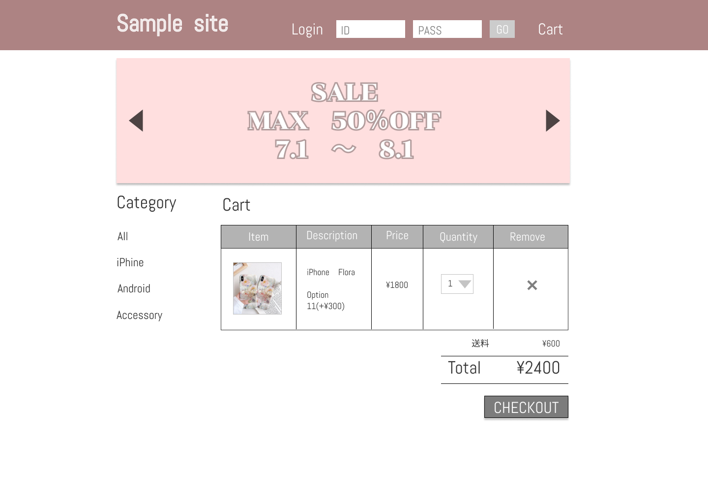

### 画面詳細図
## トップページ
### プロトタイプは以下のリンク先
[プロトタイプ](https://www.figma.com/file/p1pjGVsRkg1EWhH60j8G60/Untitled?node-id=1%3A2)
*****

 
　　
*****
補足：対応DBの列はDB設計後、〇を対応するテーブル・カラム名に差し替えること。

| ID | 要素 | 内容 | アクション | イベント | 対応DB |
|----|------|------|----------|----------|-------|
|1   |バナー|サイト名表示|-    |-         |-      |
|2   |ログイン|テキスト画像|-    |-        |-      |
|3   |ID|入力欄|テキスト入力|-        |-      |
|4   |PASS|入力欄|テキスト入力|-        |-      |
|5   |GOボタン|ボタン|クリック|ログイン処理実行|-      |
|6   |Cart|テキストリンク|クリック|カートページへ遷移|-      |
|7   |イベントバナー|画像リンク|クリック|イベントページへ遷移|-      |
|8   |Category|テキスト表示|-    |-        |-      |
|9   |All|テキストリンク|クリック|商品一覧へ遷移|-      |
|10  |iPhone|テキストリンク|クリック|商品一覧へ遷移|-      |
|11  |Android|テキストリンク|クリック|商品一覧へ遷移|-      |
|12  |Accessory|テキストリンク|クリック|商品一覧へ遷移|-      |
|13  |Ranking|テキスト表示|-    |-        |-      |
|14  |画像表示|画像リンク|クリック|商品詳細へ遷移|-      |
|15  |商品名|テキストリンク|クリック|商品詳細へ遷移|-      |
|16  |価格|テキスト表示|-    |-        |-      |
|17  |New Arrival|テキスト表示|-    |-        |-      |
|18  |画像表示|画像リンク|クリック|商品詳細へ遷移|-      |
|19  |商品名|テキストリンク|クリック|商品詳細へ遷移|-      |
|20  |価格|テキスト表示|-    |-        |-      |

